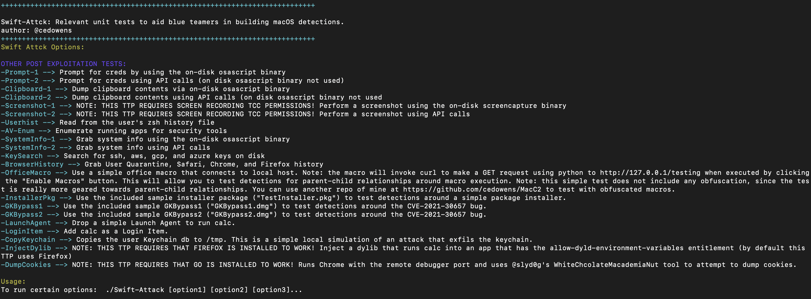

# Swift-Attack
Unit tests for blue teams to aid with building detections for some common macOS post exploitation methods. I have included some post exploitation examples using both command line history and on disk binaries (which should be easier for detection) as well as post exploitation examples using API calls only (which will be more difficult for detection). The post exploitation examples included here are not all encompassing. Instead these are just some common examples that I thought would be useful to conduct unit tests around. I plan to continue to add to this project over time with additional unit tests.

All of these tests run locally and return results to stdout (i.e., Swift-Attack does not connect to a server). 

## Steps:
> git clone https://github.com/cedowens/Swift-Attack

- Ensure you have installed swift and developer tools (can install from the mac app store)

- open the xcodeproj file in XCode

- Build in XCode

- The compiled app will be dropped to something like: ***Users/<username>/Library/Developer/Xcode/DerivedData/Swift-Attack-[random]/Build/Products/Debug/Swift-Attack.app***

- cd to the build directory above

- cd Swift-Attack.app/Contents/MacOS (you can run the macho from here or copy it elsewhere and run...up to you)

- grant the Swift-Attack macho full disk access to ensure you can run all of the tests without TCC issues

- run the following to remove any quarantine attributes:

> xattr -c Swift-Attack 

- Run Swift-Attack:

> ./Swift-Attack -h 

## Usage:

You can run Swift-Attack with a single option or multiple options

> ./Swift-Attack [option1] [option2]...

- I also included a simple macro.txt file (unobfuscated) for testing parent-child relationships around office macro executions on macOS. I did not obfuscate it since the focus is on parent-child relationship visibility/detection. If you want to test with an obfuscated macro, I have a repo at github.com/cedowens/MacC2 that contains an obfuscated macro.

- I also did not include any persistence items, since in my opinion it is best to just clone and test persistence using Leo Pitt's persistent JXA repo https://github.com/D00MFist/PersistentJXA. This repo is by far the most comprehensive and current repo that I know of for macOS persistence.

## Unit Tests Included:

- Prompt using osascript binary

- Prompt via API calls

- Clipboard dump using osascript binary 

- Clipboard dump using API calls

- Screenshot using screencapture binary

- Screenshot using API calls

- Shell commands

- Dumping zsh history

- Security tool enumeration

- Grabbing system info using osascript binary

- Grabbing system info via API calls

- Dumping ssh, aws, gcp, and azure keys on disk

- Dumping browser history (Chrome, Safari, Firefox)

- Dumping Quarantine history

- Office Macro: I included a simple office macro that connects to local host. Note: the macro will invoke curl to make a GET request using python to http://127.0.0.1/testing when executed by clicking the "Enable Macros" button. This will allow you to test detections for parent-child relationships around macro execution. Note: this simple test does not include any obfuscation, since the test is really more geared towards parent-child relationships. You can use another repo of mine at https://github.com/cedowens/MacC2 to test with obfuscated macros. To use, just simply paste the contents of "macro.txt" into an office Doc, save as a macro enabled document or as 97-2004 document format (ex: .doc, .xls, etc.), and click "Enable Macros" when opening the doc to execute.

- Installer Package: I included TestInstaller.pkg file to test for detections around a basic installer package. This installer package includes a preinstall script which runs in bash and drops com.simple.agent.plist to /Library/LaunchDaemons/ and drops test.js (simple popup prompt) to /Library/Application Support/. The com.simple.agent.plist file simply runs osascript against /Library/Application Support/test.js. It also includes a postinstall script which runs in bash and loads the com.simple.agent.plis using launchctl load. While holding the Control button click Open on TestInstaller.pkg to run it. TestInstaller.pkg will drop the aforementioned files as root.
